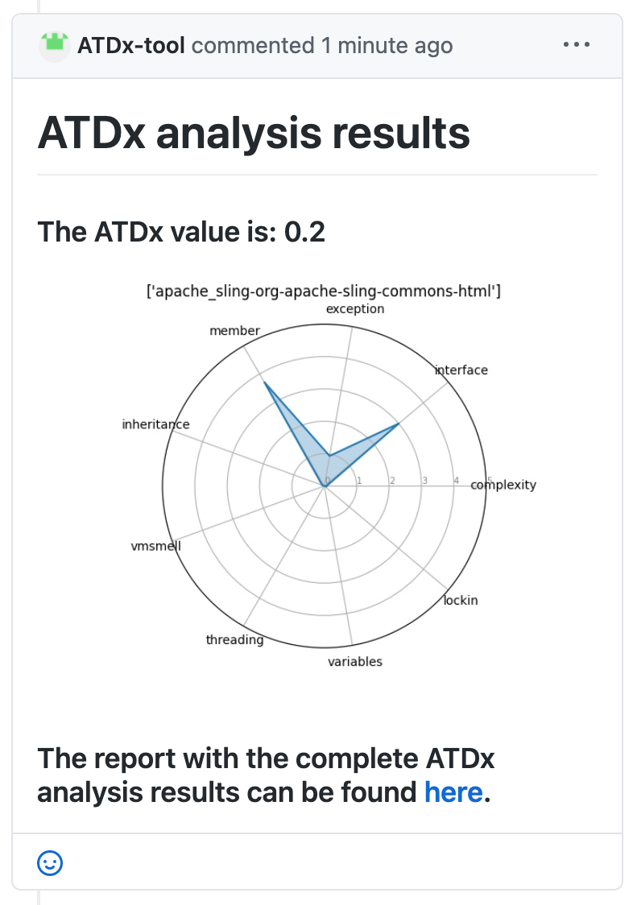

ATDx Input and Output example
----------------

### Raw input
Here you can find the raw data used in our example analysis.

 - The configuration files: 
   - [configurations.json](configuration.json)
   - [report_config.json](report_config.json)
    
 - An example for the possible input files:
   - [ar_rules.json](ar_rules.json)
   - [arch_issues.json](arch_issues.json)
   - [ar_issues.json](ar_issues.json)
   - [measures.json](measures.json)
   - [project.json](projects.json)
   - [report_config.json](report_config.json)
 
---
### The output for Server scenario
Example of GitHub comment generated automatically by the ATDx GitHub Webhook:

---
### Example of generated ATDx report

An example of report generated by ATDx (both if run locally or on a server), is available [here](reports/apache_sling-org-apache-sling-commons-html.md)

