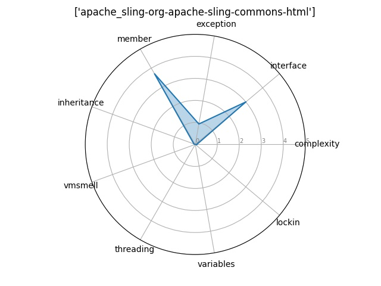

# ATDx Report Summary
Our ATDx analysis targets a portfolio of software projects and identifies the pain points of each project in terms of Architectural Technical Debt (ATD). This evaluation is based on a statistical analysis of the violations of SonarCloud rules.

## ATDx in a nutshell

ATDx works by comparing architectural debt metrics across the projects of a software portfolio. Intuitively, it ensures that measurements across different projects are comparable, and then evaluates the severity of Architectural Technical Debt by confronting the measurements across the projects.
The ATDx approach is by itself tool-independent, and can be customized according the analysis tools available, and the portfolio considered.
In the case of this report, we used an instance of ATDx based on the static analysis tool [SonarQube](https://www.sonarqube.org/).
The instance of ATDx used to analyze your projects provides an overview of the architectural technical debt in a project in distinct dimensions:
* **complexity**: flaws derived from prominent complexity measures, such as McCabe’s cyclomatic complexity
* **interface**: flaws related to the usage of Java interfaces
* **exception**: flaws regarding the management of Java exceptions and the subclassing of the “Exception” Java class
* **member**: flaws regarding the use of members
* **vmsmell**: potential misuses of the Java Virtual Machine, e.g., the incorrect usage of the specific Java class “Serializable”
* **threading**: flaws arising from the implementation of multiple execution threads, which could potentially lead to concurrency problems
* **lockin**: flaws regarding the usage of locking objects
* **Inheritance**: flaws concerning inheritance mechanisms between classes, such as overrides and inheritance of methods or fields

For each project, the dimensions assume a value between 0 and 5, where 0 denotes minimum architectural debt of the project in that dimension, and 5 maximum architectural debt.
In the reminder of this report, we give for the analysed project the following:
1. A radar chart for the project
2. A table showing the top-5 classes of the project with the highest architectural technical debt.
If you are curious about more theoretical background on ATDx, you can have a look at [this scientific publication](https://robertoverdecchia.github.io/papers/ENASE_2020.pdf).

# ATDx project report summary

### The ATDx value for this project is: 0.2001

[Project on Github](https://github.com/apache/sling-org-apache-sling-commons-html)   [Project on SonarCloud ](https://sonarcloud.io/dashboard?id=apache_sling-org-apache-sling-commons-html)  

### Top classes with architectural debt violations
| Class name                 | Complexity   | Interface   | Exception   | Member   | Inheritance   | Vmsmell   | Threading   | Variables   | Lockin   | Project                                    |
|:---------------------------|:-------------|:------------|:------------|:---------|:--------------|:----------|:------------|:------------|:---------|:-------------------------------------------|
| TagParser.java             | 15           | 3           | 8           | 3        | 0             | 0         | 0           | 0           | 0        | apache_sling-org-apache-sling-commons-html |
| Token.java                 | 0            | 8           | 0           | 8        | 0             | 0         | 0           | 0           | 0        | apache_sling-org-apache-sling-commons-html |
| ParseException.java        | 0            | 3           | 4           | 3        | 0             | 0         | 0           | 0           | 0        | apache_sling-org-apache-sling-commons-html |
| SimpleCharStream.java      | 2            | 3           | 1           | 1        | 0             | 0         | 0           | 0           | 0        | apache_sling-org-apache-sling-commons-html |
| TagParserTokenManager.java | 0            | 1           | 1           | 4        | 0             | 0         | 0           | 0           | 0        | apache_sling-org-apache-sling-commons-html |
| -                          | -            | -           | -           | -        | -             | -         | -           | -           | -        | -                                          |
